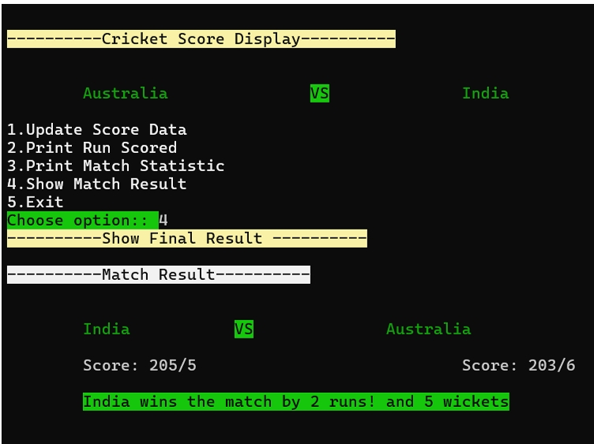

# Cricket Score Display 🏏(Mini Project)

-  [**Cricket Score Display**](https://github.com/chandradeepkumarraj/Projects/tree/383ebac192e32ac604c8368578063ed55c98745f/Cricket_Score_Display) project is made in C language. Its UI is compatible with Windows 11 **cmd**.<br> It was developed in `CodeBlock 20.03 IDE`.


A console-based C application for managing live cricket match scores with colorful ANSI UI, team selection, toss simulation, real-time updates, and detailed statistics. Developed as a mini-project for Master of Computer Applications.

## ✨ Features

- **Team Selection**: Choose from 10 international teams (Afghanistan, Australia, Bangladesh, England, India, Nepal, New Zealand, Pakistan, South Africa, Sri Lanka) with validation to prevent duplicates
- **Toss & Innings**: Simulate toss, let winner choose batting/bowling first
- **Live Score Updates**:
  - Runs, balls (max 120), wickets (max 10)
  - Sixes/fours with score consistency validation
  - Highest run scorer name
  - Innings status (ongoing/completed)
- **Statistics Display**: View runs, full match stats, and final results (win by runs/wickets, tie, or ongoing)
- **Interactive UI**: ANSI color-coded menus, error highlights, bold text for Windows CMD compatibility

## 📱 Demo





## 🚀 Quick Start

1. **Compile** (GCC/Code::Blocks):
   ```bash
   gcc -o cricket_score cricket_score_display_code.c
   ```

2. **Run**:
   ```bash
   ./cricket_score    # Linux/Mac
   cricket_score.exe  # Windows
   ```

3. Follow prompts: Select teams → Toss → Update scores → View stats/results

**Requirements**: GCC compiler, terminal with ANSI support (Windows 11 CMD tested)

## 📁 Project Structure

```
Cricket_Score_Display/
├── cricket_score_display_code.c  # Main source code (17.7k lines)
├── Project_report.pdf            # Detailed documentation (74 pages)
└── README.md                    # You're reading it!
```

## ⚙️ Technical Details

### Data Structure
```c
struct Team {
    char team_name;
    int score, ball, wicket, six, four, inning;
    char player_scored_highest_run;
};
```

### Key Functions
| Function | Purpose |
|----------|---------|
| `selectteam()` | Team selection from list |
| `toss_check()` | Toss winner selection |
| `update_score_data()` | Score/ball/wicket/sixes/fours input + validation |
| `print_match_statistics()` | Detailed team stats |
| `show_match_result()` | Win/tie/ongoing result |

**Validation Examples**:
- Balls ≤ 120, wickets ≤ 10
- Score ≥ (6×sixes + 4×fours)

## 🧪 Testing & Validation

✅ **Test Cases Covered**:
- Team selection conflict (same team twice)
- Invalid toss/choice inputs
- Balls > 120, wickets > 10
- Score inconsistency with sixes/fours
- Match results (win/tie/ongoing)

✅ **Error Handling**:
- Color-coded error messages
- Input re-prompting
- Data integrity checks

## 🎯 Objectives Achieved
- Basic C concepts: structures, arrays, pointers, functions, control flow
- Modular design with input validation
- Engaging console UI using ANSI escapes

## 🔮 Future Enhancements
- File I/O for match saving/loading
- GUI version (ncurses/Qt)
- Multi-format support (T20/ODI/Test)
- Network multiplayer score sharing

## 👨‍💻 Author
**Chandradeep Kumar Raj**  
MCA
Greater Noida Institute of Technology  
January 2025

## 📄 License
MIT License - Feel free to use and modify!

---

⭐ **Star this repo if useful!**  
📁 **Clone & compile**: `git clone <repo-url>`  
🐛 **Issues?** Open a ticket!
```
